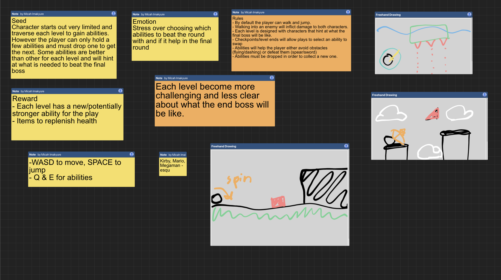

# Pigeon Attack!

## Table of Contents
1. [About the Game](#about-the-game)
2. [Gameplay](#gameplay)
3. [Midsemester Game Demo](#midsemester-game-demo)
4. [Early Game Concept](#early-game-concept)
5. [Meet the Team](#meet-the-team)
6. [Links](#links)

## About the Game

### Controls 

  - WASD to control the pigeon 
  - SPACE to poop
  - Ground: SPACE to fly again

### Synopsis 

Playing as a pigeon, the goal is to cause chaos throughout the city by pooping on various objects in the city. 
In this endless runner game, the player must collect food items on the ground to generate poop and regenerate health while 
dodging city obstacles. As the player spends more time causing chaos in the city, things may speed up.

### Rules

  - Collect food item to generate poop and health
  - Poop on various city objects to increase chaos meter
  - Enemies and city obstacles does damage
  - Speed increases the longer the player stays alive

## Gameplay

### Watch

<iframe width="560" height="315" src="https://www.youtube-nocookie.com/embed/Yfb9j53PZ9M" title="YouTube video player" frameborder="0" allow="accelerometer; autoplay; clipboard-write; encrypted-media; gyroscope; picture-in-picture" allowfullscreen></iframe>

### Play on SIMMER.io

<iframe src="https://i.simmer.io/@rainllo/pigeon-attack" style="width:960px;height:600px"></iframe>

## Midsemester Game Demo

## Early Game Concept

Individual Story Boards

By Micah Imakyure

By Rainier Javillo

By Karen Wong

## Meet the Team
    
  - Micah Imakyure
    - Player Model/Animation
    - Point System
    - Bird Poop Interaction
    - Audio/Sounds

  - Karen Wong
    - Menu/Ending UI
    - Menu/Ending Screens
    - Building Prefabs
    - Audio/Sounds
    - Health System
    - Bird Object Interaction
    
  - Rainier Javillo
    - Obstacle Prefabs
    - Food Prefabs
    - Decoration Prefabs
    - Audio/Sounds
    - Enemy/Turret AI
    - Randomized Food Spawning
    - Randomized Obstacle Spawning
    - Obstacle Movement
    - Procedural Endless Map Generator

## Links

[Repository](https://github.com/team-birb/Pigeon_Attack)

[Wiki Page](https://team-birb.github.io/#meet-the-team)

[Trello](https://trello.com/b/M1YDDiWs/birb)

